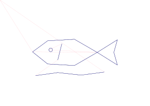
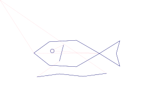
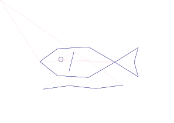
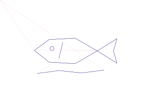
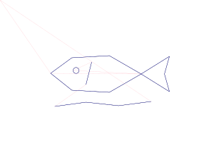

# AxiDraw Sakana Fugu Demo

Local browser demo that turns a text prompt or webcam still into plotter-friendly SVG geometry, previews the pen path, and can send the selected SVG to an AxiDraw when the local Python environment has the AxiDraw API installed.

| UI | Plotter preview |
| --- | --- |
|  |  |

## What It Does

- Prompt mode asks Fugu for a compact drawing plan, sanitizes the geometry, and renders SVG for AxiDraw.
- Webcam contour mode uses OpenCV for a fast local contour drawing.
- Webcam Fugu cleanup mode sends only the compact contour geometry to Fugu so the model can simplify and preserve the recognizable subject while keeping the plot feasible.
- Plot preview mode runs `axicli` when available; without it, the app still displays the generated SVG.
- Hardware plotting is guarded and can be kept in dry-run mode with `AXIDRAW_DRY_RUN=true`.

## Simulation Comparison

Shared task: each model is asked to produce compact AxiDraw JSON plans for the same five drawing prompts: simple fish, robot face, flower, geometric turtle, and skyline. The benchmark then uses the existing plan sanitizer, SVG generator, and offline plot-preview path. This is simulation-only: it measures whether the output can become bounded SVG and preview artifacts, not physical plotter performance, pen behavior, paper handling, or final drawing quality on hardware.

Model set:

- `fugu_ultra`: Fugu Ultra (xhigh)
- `fugu`: Fugu (xhigh)
- `gpt`: GPT-5.5
- `gemini`: Gemini 3.1 Pro
- `opus`: Claude Opus 4.8 (max)

The checked-in results below are from deterministic dry-run fixture responses so the benchmark is reproducible without API credentials. Live runs use the same harness and read credentials/model IDs from environment variables only.

```bash
cd demos/axidraw_fugu_demo
python3 scripts/benchmark_axidraw_models.py --dry-run
python3 scripts/benchmark_axidraw_models.py --summary-only
```

| Model | Valid JSON | Sanitized | SVG | Preview | Avg commands | Avg pen distance | Bounds violations | Avg latency | Notes |
| --- | ---: | ---: | ---: | ---: | ---: | ---: | ---: | ---: | --- |
| Fugu Ultra (xhigh) | 5/5 | 5/5 | 5/5 | 5/5 | 5.4 | 751.7 mm | 0 | n/a | dry-run |
| Fugu (xhigh) | 5/5 | 5/5 | 5/5 | 5/5 | 5.4 | 753.0 mm | 0 | n/a | dry-run |
| GPT-5.5 | 5/5 | 5/5 | 5/5 | 5/5 | 5.4 | 754.3 mm | 0 | n/a | dry-run |
| Gemini 3.1 Pro | 5/5 | 5/5 | 5/5 | 5/5 | 5.4 | 755.6 mm | 0 | n/a | dry-run |
| Claude Opus 4.8 (max) | 5/5 | 5/5 | 5/5 | 5/5 | 5.4 | 757.0 mm | 0 | n/a | dry-run |

Representative preview artifacts from the simple-fish prompt:

| Model | Preview | Metrics |
| --- | --- | --- |
| Fugu Ultra (xhigh) |  | [metrics](benchmark_results/fugu_ultra/metrics.json) |
| Fugu (xhigh) |  | [metrics](benchmark_results/fugu/metrics.json) |
| GPT-5.5 |  | [metrics](benchmark_results/gpt/metrics.json) |
| Gemini 3.1 Pro |  | [metrics](benchmark_results/gemini/metrics.json) |
| Claude Opus 4.8 (max) |  | [metrics](benchmark_results/opus/metrics.json) |

Conservative notes: all fixture responses produced valid JSON, survived sanitization, stayed within page bounds, and generated preview reports. The dry-run artifacts are useful for checking the pipeline and README media paths; they should not be read as a live quality ranking. In a live run, latency and failure notes become meaningful, and any differences should be reviewed alongside the raw responses and preview SVGs under `benchmark_results/<model>/`.

## Run Locally

```bash
cd demos/axidraw_fugu_demo
python3 -m venv .venv
source .venv/bin/activate
pip install -r requirements.txt
export SAKANA_API_KEY=<your-api-key>
export AXIDRAW_DRY_RUN=true
```

Leave `SAKANA_BASE_URL` unset to use `https://api.sakana.ai/v1`, or set it to another OpenAI-compatible `/v1` endpoint for testing.

```bash
python app/server.py
```

Open [http://127.0.0.1:8776](http://127.0.0.1:8776).

## AxiDraw Setup

For physical plotting, install the official AxiDraw Python API/CLI in the same environment and connect the plotter over USB. Keep `AXIDRAW_DRY_RUN=true` until the preview looks correct.

Place the pen at the paper origin before plotting. For the AxiDraw coordinate system used here, that is the upper-left corner of the sheet, with positive X moving right and positive Y moving down.

## Files

- `app/server.py` runs the local dashboard and guarded job endpoints.
- `app/static/` contains the browser UI.
- `scripts/generate_axidraw_svg.py` handles Fugu calls, plan sanitization, and SVG output.
- `scripts/vectorize_camera_frame.py` creates local OpenCV contour plans from webcam/image stills.
- `scripts/cleanup_contour_with_fugu.py` asks Fugu to clean a compact contour plan.
- `scripts/plot_axidraw_svg.py` sends generated SVGs to AxiDraw through `pyaxidraw`.
- `demo_media/` contains the README UI screenshot and animated plotter preview.
- `outputs/` is created at runtime for generated SVG, JSON, and previews.
