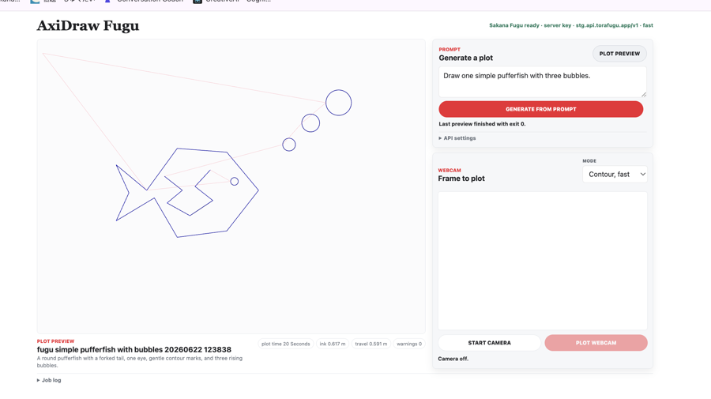
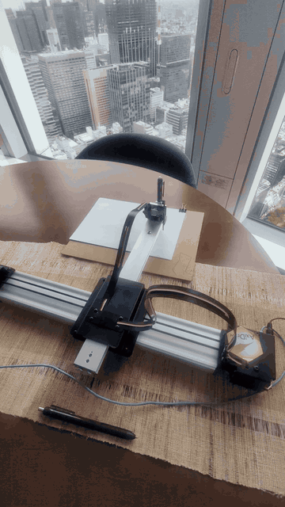

# AxiDraw Sakana Fugu Demo

Local browser demo that turns a text prompt or webcam still into plotter-friendly SVG geometry, previews the pen path, and can send the selected SVG to an AxiDraw when the local Python environment has the AxiDraw API installed.

| UI | Plotter preview |
| --- | --- |
|  |  |

## What It Does

- Prompt mode asks Fugu for a compact drawing plan, sanitizes the geometry, and renders SVG for AxiDraw.
- Webcam contour mode uses OpenCV for a fast local contour drawing.
- Webcam Fugu cleanup mode sends only the compact contour geometry to Fugu so the model can simplify and preserve the recognizable subject while keeping the plot feasible.
- Plot preview mode runs `axicli` when available; without it, the app still displays the generated SVG.
- Hardware plotting is guarded and can be kept in dry-run mode with `AXIDRAW_DRY_RUN=true`.

## Run Locally

```bash
cd demos/axidraw_fugu_demo
python3 -m venv .venv
source .venv/bin/activate
pip install -r requirements.txt
export SAKANA_API_KEY=<your-api-key>
export AXIDRAW_DRY_RUN=true
```

Leave `SAKANA_BASE_URL` unset to use `https://api.sakana.ai/v1`, or set it to another OpenAI-compatible `/v1` endpoint for testing.

```bash
python app/server.py
```

Open [http://127.0.0.1:8776](http://127.0.0.1:8776).

## AxiDraw Setup

For physical plotting, install the official AxiDraw Python API/CLI in the same environment and connect the plotter over USB. Keep `AXIDRAW_DRY_RUN=true` until the preview looks correct.

Place the pen at the paper origin before plotting. For the AxiDraw coordinate system used here, that is the upper-left corner of the sheet, with positive X moving right and positive Y moving down.

## Files

- `app/server.py` runs the local dashboard and guarded job endpoints.
- `app/static/` contains the browser UI.
- `scripts/generate_axidraw_svg.py` handles Fugu calls, plan sanitization, and SVG output.
- `scripts/vectorize_camera_frame.py` creates local OpenCV contour plans from webcam/image stills.
- `scripts/cleanup_contour_with_fugu.py` asks Fugu to clean a compact contour plan.
- `scripts/plot_axidraw_svg.py` sends generated SVGs to AxiDraw through `pyaxidraw`.
- `demo_media/` contains the README UI screenshot and animated plotter preview.
- `outputs/` is created at runtime for generated SVG, JSON, and previews.
