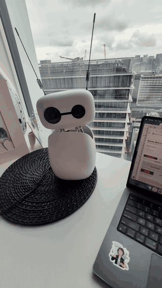

# Reachy Mini Fugu Demo

Minimal Gradio demo for robot-sourced conversation with Reachy Mini and Sakana Fugu. Reachy listens through the robot microphone, sends the transcribed question to Fugu, speaks the short answer back, and moves through validated gentle gestures while the browser shows the transcript, answer, audio, and plan.



## What It Does

- Uses Reachy Mini microphone input for the primary conversation path.
- Uses Reachy camera or direction-of-arrival tracking cues when available.
- Calls Sakana Fugu through the OpenAI-compatible chat completions endpoint.
- Synthesizes speech locally and plays it through Reachy's daemon speaker.
- Keeps the browser as an operator dashboard and manual text fallback.

## Run Locally

```bash
cd demos/reachy_mini_fugu_demo
python3 -m venv .venv
source .venv/bin/activate
pip install -r requirements.txt
```

For a no-key UI smoke test:

```bash
export FUGU_DRY_RUN=1
export REACHY_HARDWARE_ENABLED=0
python app.py
```

For robot mode:

```bash
export SAKANA_API_KEY=<your-api-key>
export REACHY_DAEMON_URL=http://127.0.0.1:8000
export REACHY_HARDWARE_ENABLED=1
python app.py
```

Open [http://127.0.0.1:7860](http://127.0.0.1:7860).

## Simulation Comparison

The comparison task sends the same five typed user questions through the Reachy answer pipeline, including the robot prompt, JSON parsing, schema normalization, gesture-plan validation, and local TTS synthesis. It does not require physical Reachy hardware, a robot microphone, a robot camera, or browser microphone/camera access.

Questions:

- "What can you do?"
- "Tell me one fun fact about pufferfish."
- "Can you explain what you are seeing?"
- "How would you help a child learn robotics?"
- "Say hello and wave."

Model set:

- `fugu_ultra`: Fugu Ultra, `xhigh`
- `fugu`: Fugu, `xhigh`
- `gpt`: GPT-5.5, `xhigh`
- `gemini`: Gemini 3.1 Pro, `high`
- `opus`: Claude Opus 4.8, `max`

Run the deterministic smoke comparison:

```bash
cd demos/reachy_mini_fugu_demo
python3 scripts/run_simulation_benchmark.py --mode smoke
```

For live API-backed comparison, set keys in the shell environment and run `--mode live`. `SAKANA_API_KEY` is used for Fugu models, and `OPENROUTER_API_KEY` is used for GPT-5.5, Gemini 3.1 Pro, and Claude Opus 4.8.

Per-model artifacts are written under `benchmark_results/<model>/`:

- `raw_responses.jsonl`
- `parsed_responses.json`
- `gesture_plans.json`
- `audio_metadata.json`
- `metrics.json`

The checked-in table below is from the smoke run. It measures simulated pipeline behavior with deterministic model fixtures, not live model quality and not robot-hardware performance.

| model | run | valid JSON | schema valid | answer | gesture plan | unknown primitives | TTS | fallbacks | median model ms |
| --- | --- | --- | --- | --- | --- | --- | --- | --- | --- |
| fugu_ultra | Fugu Ultra (xhigh) | 5/5 | 5/5 | 5/5 | 5/5 | none | 5/5 | 0/5 | 0 |
| fugu | Fugu (xhigh) | 5/5 | 5/5 | 5/5 | 5/5 | none | 5/5 | 0/5 | 0 |
| gpt | GPT-5.5 (xhigh) | 5/5 | 5/5 | 5/5 | 5/5 | none | 5/5 | 0/5 | 0 |
| gemini | Gemini 3.1 Pro (high) | 5/5 | 5/5 | 5/5 | 5/5 | none | 5/5 | 0/5 | 0 |
| opus | Claude Opus 4.8 (max) | 5/5 | 5/5 | 5/5 | 5/5 | none | 5/5 | 0/5 | 0 |

Qualitative notes:

- All smoke fixtures returned parseable JSON matching the Reachy schema and gesture whitelist.
- No run used unsafe or unknown motion primitives; the generated plans stayed within the existing gentle primitive set.
- No fallback gesture plan was needed in the smoke run, so live comparisons should pay close attention to the `fallback_used` and `failure_reason` fields.
- The TTS metric only checks local synthesis and file metadata. It does not measure Reachy speaker playback, daemon media state, microphone capture, camera tracking, or physical motion quality.

## Reachy Setup

Start the Reachy daemon and keep `REACHY_DAEMON_URL` pointed at it. Set `REACHY_HARDWARE_ENABLED=1` only when the robot is connected and ready. The main robot flow is **Start Robot Conversation**; **Preview Locally** and the text box are fallback controls.

## Files

- `app.py` runs the Gradio dashboard and conversation loop.
- `src/reachy_fugu/` contains Fugu calls, speech, robot input, and playback glue.
- `scripts/run_simulation_benchmark.py` runs the hardware-free model comparison.
- `benchmark_results/` contains the compact smoke-run comparison artifacts.
- `reachy_fugu_demo/` contains the small Reachy primitive layer used by playback.
- `demo_media/reachy_mini_fugu_demo.gif` is the README demo preview.
